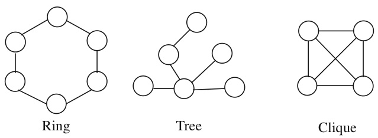

# Chapter 1

# A Few Definitions and Two Introductory Examples

This chapter introduces basic definitions and basic computing models associated with fault-tolerant message-passing distributed systems. It also presents two simple distributed computing problems, whose aim is to give a first intuition of what can be done and what cannot be done in message-passing systems prone to failures. Consequently, this chapter must be considered as an introductory warm-up chapter.  
Keywords Algorithm, Automaton, Asynchronous system, Byzantine process, Communication graph, Distributed algorithm, Distributed computing model, Distributed computing problem, Fair communication channel, Liveness property, Message adversary, Message loss, Non-determinism, Process crash failure, Process mobility, Safety property, Spanning tree, Synchronous system.  

# 1.1 A Few Definitions Related to Distributed Computing

Distributed computing “Distributed computing was born in the late 1970s when researchers and practitioners started taking into account the intrinsic characteristic of physically distributed systems. The field then emerged as a specialized research area distinct from networking, operating systems, and parallel computing.
Distributed computing  arises when one has to solve a problem in terms of distributed entities (usually called processors, nodes, processes, actors, agents, sensors, peers, etc.) such that each entity has only a partial knowledge of the many parameters involved in the problem that has to be solved.”  
The fact the computing entities and their individual inputs are distributed is not under the control of the programmers but is imposed on them. From an architectural point of view, this is expressed in  Fig. 1.1, where a pair $\langle p_{i},i n_{i}\rangle$ denotes a computing entity $p_{i}$ and its associated input $i n_{i}$ (this is formalized with the notion of a distributed task  introduced in Section 1.3, page 12). 
The concept of a sequential process A  sequential algorithm  is a formal description of the behavior of a sequential state machine: the text of the algorithm states the transitions that have to be sequentially executed. When written in a specific programming language, an algorithm is called a  program .  
The concept of a  process  was introduced to highlight the difference between an algorithm as a text and its execution on a processor. While an algorithm is a text that describes statements that have to be executed (such a text can also be analyzed, translated, etc.), a process is a “text in action”, namely the dynamic entity generated by the execution of an algorithm (program) on a processor (computing device). At any time, a process is characterized by its state (which comprises, among other things, the current value of its program counter). A sequential process is a process defined by a single control  
  
Figure 1.1: Basic structure of distributed computing  
flow: its behavior is managed by a single program counter, which means it executes a single step at a time.  
Distributed system As depicted in  Fig. 1.1 , a distributed system is made up of a collection of distributed computing units, each one abstracted through the notion of a  process , interconnected by a communication medium. As already said, the distribution of the processes (computing units) is not under the control of the programmers, it is imposed on them.  
In this book we assume that the set of processes is static. Composed of $n$ processes, it is denoted $\Pi=\{p_{1},...,p_{n}\}$ , where each $p_{i}$ , $1\leq i\leq n$ , represents a distinct process. The integer $i$ denotes the index  of process $p_{i}$ , i.e., the way an external observer can distinguish processes. It is nearly always assumed that each process $p_{i}$ has its own identity, which is denoted $i d_{i}$ . In a lot of cases $i d_{i}=i$ .  
The processes are assumed to cooperate on a common goal, which means that they exchange information in one way or another. This book considers that the processes communicate by exchanging messages on top of a communication network (see for example  Fig. 1.2 ). Hence, the automaton associated with each process provides it with basic point-to-point send and receive operations.  
Communication medium The processes communicate by sending and receiving  messages  through channels . A channel can be reliable (neither message loss, creation, modi cation, nor duplication), or unreliable. Moreover, a channel can be synchronous or asynchronous.  Synchronous  means that there is an upper bound on message transfer delays, while  asynchronous  means there is no such bound. In any case, an algorithm must specify the properties it assumes for channels. As an example, an asynchronous reliable channel guarantees that each message takes a finite time to travel from its sender to its receiver. Let us notice that this does not guarantee that messages are received in their sending order. A channel satisfying this last property is called a  first in first out  (FIFO) channel.  
Each channel is assumed (a) to be bidirectional (it can carry messages in both directions) and (b) to have an infinite capacity (it can contain any number of messages, each of any size).  
Each process $p_{i}$ has a set of neighbors, denoted  neighbors i . According to the context, this set contains either the local identities of the channels connecting $p_{i}$ to its neighbor processes or the identities of these processes.  
Structural view It follows from the previous definitions that, from a structural point of view, a distributed system can be represented by a connected undirected graph $G=(\Pi,C)$ (where $C$ denotes the set of channels). Three types of graphs are of particular interest ( Fig. 1.2 ):  
•  A  ring  is a graph in which each process has exactly two neighbors with which it can communicate directly, a left neighbor and a right neighbor.  
•  A  tree  is a graph that has two noteworthy properties: it is acyclic and connected (which means that adding a new channel would create a cycle, while suppressing a channel would disconnect it). •  A  fully connected  graph is a graph in which each process is directly connected to every other process. (In graph terminology, such a graph is called a clique.)  
  
Figure 1.2: Three graph types of particular interest  
Distributed algorithm A  distributed algorithm  is a collection of $n$ automata, one per process. An automaton describes the sequence of steps executed by the corresponding process.  
In addition to the power of a Turing machine, an automaton is enriched with two communication operations which allows it to send a message on a channel or receive a message on any channel. The operations are denoted “ send () ” and “ receive () ”.  
Synchronous algorithm A distributed  synchronous  algorithm is an algorithm designed to be executed on a synchronous distributed system. The progress of such a system is governed by an external global clock, denoted $R$ , whose domain is the sequence of increasing integers. The processes collectively execute a  sequence of rounds , each round corresponding to a value of the global clock.  
During a round, a process sends a message to a subset of its neighbors. The fundamental property of a  synchronous  system is that a message sent by a process during a round $r$ is received by its destination process during the very same round $r$ . Hence, when a process proceeds to the round $(r+1)$ , it has received (and processed) all the messages that have been sent to it during round $r$ , and it knows the same holds for any process.  
Space/time diagram A distributed execution can be graphically represented by a  space/time diagram . Each sequential progress is represented by an arrow from left to right, and a message is represented by an arrow from the sending process to the destination process.  
The space/time diagram on the left of  Fig. 1.3  represents a synchronous execution. The vertical lines are used to separate the successive rounds. During the first round, $p_{1}$ sends a message to $p_{3}$ , and $p_{2}$ sends a message to $p_{1}$ , etc.  
  
Figure 1.3: Synchronous execution (left) vs. asynchronous execution (right)  
Asynchronous algorithm A distributed  asynchronous  algorithm is an algorithm designed to be executed on an asynchronous distributed system. In such a system, there is no notion of an external time, which is why asynchronous systems are sometimes called  time-free  systems.  
In an asynchronous algorithm, the progress of a process is ensured by its own computation and the messages it receives. When a process receives a message, it processes the message and, according to its local algorithm, possibly sends messages to its neighbors.  
A process processes one message at a time. This means that the processing of a message cannot be interrupted by the arrival of another message. When a message arrives, it is added to the input buffer of the destination process $p_{j}$ , and remains in it until an invocation of  receive ()  by $p_{j}$ returns it.  
The space/time diagram of a simple asynchronous execution is depicted on the right of  Fig. 1.3 . One can see that, in this example, the messages from $p_{1}$ to $p_{2}$ are not received in their sending order. Hence, the channel from $p_{1}$ to $p_{2}$ is not a FIFO (first in first out) channel. It is easy to see from the figure that a synchronous execution is more structured (i.e., synchronized) than an asynchronous execution.  
Synchronous round vs asynchronous round In the synchronous model, the rounds, and their progress, belong to the model. In the asynchronous model, rounds are not given for free, but can be built by the processes. Nevertheless, when a process terminates a round $r$ , it cannot conclude that the other processes are simultaneously doing the same. When there are failures, it cannot even conclude that all other processes will attain the round $r$ it is executing.  
Event and execution An  event  models the execution of a step issued by a process, where a step is either a local step (communication-free local computation), or a communication step (the sending of a message, or the reception of a message). An  execution $E$ is a partial order on the set of events produced by the processes.  
•  In the context of a synchronous system, $E$ the processes, such that all the events occurring in a round $r$ precede all the events of the round $(r+1)$ , and, inside every round, all sending events, precede all reception events, which in turn precede all local events executed in this round. •  In the context of an asynchronous system, $E$ is the partial order on the events produced by the processes such that, for each process, $E$ respects the total order on its events, and, for any message $m$ sent by a process $p_{i}$ to a process $p_{j}$ , the sending of $m$ event occurs before its reception event by $p_{j}$ .  
Process failure models Two main process failures models are considered in this book:  
•  Crash  failures. A process commits a crash failure when it prematurely stops its execution. Until it crashes (if it ever crashes), a process correctly executes its local algorithm. •  Byzantine  failures. A process commits a Byzantine failure when it does not follow the behavior assigned to it by its local algorithm. This kind of failure is also called  arbitrary  failure (sometimes known as  malicious  when the failure is intentional). Let us notice that crash failures (which are an unexpected definitive halt) are a proper subset of Byzantine failures. A simple example of a Byzantine failure is the the following: while it is assumed to send the same value to all processes, a process sends different values to different subsets of processes, and no value at all to other processes. This is a typical Byzantine behavior. Moreover, Byzantine processes can collude to foil the processes that are not Byzantine.  
From a terminology point of view, let us consider an execution $E$ (an execution is also called a run). The processes that commit failures are said to be  faulty  in $E$ . The other processes are said to be  correct  or  non-faulty  in $E$ . It is not known in advance if a given process is correct or faulty, this is specific to each execution. Given a process failure model, the model parameter $t$ is used to denote the maximal number of processes that can be faulty in an execution.  
Channel failure model Thanks to error-detecting/correcting codes, corrupted messages can be corrected, and received correctly. If a corrupted message cannot be corrected, it can be discarded, and then appears as a lost message. This means that, in practice, the important channel failure is the possibility to lose messages. These notions will be investigated in depth in Chapter 3, under the name fair channel  assumption. Intuitively, fair channels experiences uncontrolled transient periods during which messages are lost.  
Solving a problem A problem is defined by a set of properties (see examples in the two next sections). One of these properties (usually called  liveness  or  termination ) states that “something happens”, i.e., a result is computed. The other properties are  safety  properties (according to what they state, they are called  validity, agreement, integrity , etc.). The safety properties state that “nothing bad happens”, consequently they describe properties that must never be violated (invariants). The decomposition of the definition of a problem into several properties facilitates both its understanding (as a problem) and the correctness proof of the algorithms that claim to solve it.  
An  algorithm solves a problem  in a given computing model $M$ if, assuming the inputs are correct, there is a proof showing that any run of the algorithm in $M$ satisfies all the properties defining the problem. (Observe that an algorithm designed for a model $M$ is not required to work when executed   in a model $M^{\prime}$ which does not satisfy the requirements of $M$ .)  

# 1.2 Example 1: Common Decision Despite Message Losses

This section and the next one present two simple distributed computing problems in systems where no process is faulty, but messages can be lost. Their aim is to make the readers familiar with basic issues of fault-tolerant distributed computing, and, given a distributed computing model, help them to have a first intuition of what can be done in this model, and what cannot be done. Let us remember that a model defines an abstraction level. It has to be accurate enough to capture the important phenomena that do really occur, and abstract enough to allow reasoning on the runs of the algorithms executed on top of it.  

# 1.2.1 The Problem

This problem concerns an irrevocable decision-making by two processes. It seems to have its origin in the design of communication protocols, as presented by E.A. Akkoyunlu, E. Ekanadham, and R.V. Huber (1975). It then appeared in databases, where it was formalized by J. Gray (1978) under the name  The two generals  problem (there are variants of this problem, e.g., in synchronous systems).  
A metaphor The name of the problem comes from the following analogy. Let us consider two hilltops $T1$ and $T2$ separated by a valley $V$ . There are two armies $A$ and $B$ . The army $A$ is composed of two divisions $A1$ and $A2$ , each with a general, the general-in-chief being located in division $A1$ . Moreover, $A1$ is camping on $T1$ , while $A2$ is camping on $T2$ . Army $B$ is in between, camping in the valley $V$ . The only way $A1$ and $A2$ can communicate is by sending messengers who need to traverse the valley $V$ . But messengers can be captured by army $B$ , and never arrive. It is nevertheless assumed that not all messengers sent by $A1$ and $A2$ can be captured.  
The generals of army $A$ previously agreed on two possible battle plans  bp 1  and $b p2$ , but, according to his analysis of the situation, it is up to the general-in-chief to decide which plan must be adopted. To this end, the general-in-chief must communicate his decision to the general of $A2$ so that they both adopt the same battle plan (and win).  
The problem consists in designing a distributed algorithm (a sequence of message exchanges initiated by the general-in-chief in $A1$ ), at the end of which (a) $A2$ knows the battle plan selected by $A1$ , and (b) both $A1$ and $A2$ know they no longer have to send or receive messages.  
System model Let $p_{1}$ and $p_{2}$ be two processes representing $A1$ and $A2$ , respectively, connected by a bi-directional asynchronous channel controlled by the army $B$ . The processes are assumed to never fail. While no message can be modified (corrupted), the channel is asynchronous and unreliable in the sense that messages can be lost (a message loss represents a messenger captured by army $B$ ). It is nevertheless assumed that not all messages sent by $p_{1}$ to $p_{2}$ (and by $p_{2}$ to $p_{1}$ ) can be lost (otherwise, there is a possible run in which the processes could not communicate, making the problem impossible to solve). As mentioned previously, a channel can experience unexpected transient periods during which messages are lost.  
Formalizing the problem As the general-in-chief of army $A$ is in $A1$ , process $p_{1}$ activates the sequence of message exchanges by sending the message  DECIDE $(b p)$ to $p_{2}$ , where $b p$ is the number of the chosen battle plan.  
For $i\in\{1,2\}$ , let $done_{i}$ be a local variable of $p_{i}$ initialized to  no  (for the corresponding process, no decision has been made). Hence, representing a global state by the pair $\langle d o n e_{1}$ , done 2 ⟩ , the initial global state is the pair $\langle\mathsf{n o},\,\mathsf{n o}\rangle$ . At the end of its execution, the distributed algorithm must stop in the global state $\langle\mathtt{y e s},\ \mathtt{y e s}\rangle$ . When $done_{i}=\tt y e s$ , process $p_{i}$ knows (a) that each process knows the selected battle plan, and (b) there is no need for messages to be exchanged, namely each process terminates its local algorithm (see  Fig. 1.4 ). This is captured by the following properties:  
-  Validity. A final global state cannot contain both  yes  and  no .  
-  Liveness. If $p_{1}$ activates the algorithm, it eventually and permanently enters the local state $done_{1}=\mathbf{y}\mathbf{e}\mathbf{s}$ .  
The validity property states which are the correct outputs of the algorithm: in no case $p_{1}$ and $p_{2}$ are allowed to disagree. The liveness property states that, if $p_{1}$ starts the algorithm, it must eventually progress. (Let us notice that, it then follows from the validity property that both processes must progress.)  
  
Figure 1.4: Algorithm structure of a common decision-making process  
A practical instance of the problem Let us consider two processes $p_{1}$ and $p_{2}$ communicating through an unreliable fair channel. Let us assume that, after some time, they want to close their working session; this disconnection being initiated by $p_{1}$ . Hence, in the previous parlance, they are both in the local state $done_{i}\;=\;\mathsf{no}$ , and they have to progress to the global state $\langle\mathtt{yes},\ \mathtt{yes}\rangle$ .  
As the reader can see, the closing session problem is nothing other than an instance of the previous “common decision-making in the presence of message losses” problem.  

# 1.2.2 Trying to Solve the Problem: Attempt 1

Starting with $p_{1}$ Let us try to design an algorithm for $p_{1}$ . As messages (but not all) sent by $p_{1}$ to $p_{2}$ can be lost, a simple idea is to require $p_{1}$ to repeatedly send a message denoted $DECIDE(bp)$ to $p_{2}$ until it has received an acknowledgment ( $\mathit{bp}$ is the – dynamically defined by $p_{1}$ – number of the selected battle plan):  
$$
\begin{aligned}
&  done_{1}\gets\mathsf{no};\\
& bp\leftarrow\ \textnormal{selected\ battle\ plan}\ \in\{1,2\};\\
& \mathbf{repeat}\ \textnormal{send}\ DECIDE (bp)\ \textnormal{to}\ p_{2}\ \mathbf{until}\ ACK\ (DECIDE)\ \textnormal{received\ from}\ p_{2}\ \mathbf{end\ repeat};\\
& done_{1}\gets\mathsf{yes}. 
\end{aligned}
$$
Continuing with $p_{2}$ While in the state $done_{2}=\texttt{n o}$ , $p_{2}$ receives the message  DECIDE $(b p)$ , it sends back to $p_{1}$ the acknowledgment message  ACK ( DECIDE ), but this acknowledgment message can be lost. Hence $p_{2}$ must resend  ACK ( DECIDE ) until it knows a copy of it has been received by $p_{1}$ . Consequently, the local algorithm of $p_{1}$ must be enriched with a statement sending an acknowledgment message back to $p_{2}$ that we denote $\scriptstyle\mathrm{ACK}^{2}$ ( DECIDE ). We then obtain the following local algorithms for $p_{2}$ :  
$done_{2}\gets\mathsf{n o};$ wait (message  DECIDE $(b p)$ from $p_{1.}$ ); repeat  send  ACK ( DECIDE )  to $p_{1}$ until $\mathrm{ACK^{2}}$ ( DECIDE )  received from $p_{1}$ end repeat ; $done_{2}\gets\mathtt{y e s.}$ .  
Returning to $p_{1}$ As $p_{1}$ is required to send the message $\mathrm{ACK}^{2}(\mathrm{DECIDE})$ to $p_{2}$ , and this message  must be received  by $p_{2},p_{1}$ $p_{2}$ . As we have seen, the only way for $p_{1}$ to know if $p_{2}$ received $\mathrm{ACK^{2}}$ ( DECIDE ) is to receive an acknowledgment message $\mathrm{ACK^{3}}$ ( DECIDE ) from $p_{2}$ . We then have the following enriched algorithm for $p_{1}$ :  
$done_{1}\gets\mathsf{n o};$ $b p\leftarrow$ selected battle plan number $\in\{1,2\}$ ; repeat  send  DECIDE $(b p)$ to $p_{2}$ until  ACK ( DECIDE )  received from $p_{2}$ end repeat ; repeat  send $\scriptstyle\mathrm{ACK}^{2}$ ( DECIDE )  to $p_{2}$ until $\mathrm{ACK^{3}}$ ( DECIDE )  received from $p_{2}$ end repeat ; $done_{1}\gets\mathtt{y e s}$ .  
And so on forever As the reader can see, this approach does not work. An infinity of distinct acknowledgment messages is needed, each acknowledging the previous one.  

# 1.2.3 Trying to Solve the Problem: Attempt 2

Trying to modify both local algorithms In order to prevent the sending of an infinite sequence of different acknowledgment messages, let us consider the same algorithm as before for $p_{1}$ , namely, $p_{1}$ sends $\scriptstyle\mathrm{DEDE}\left(b p\right)$ until it knows that $p_{2}$ has received it. When this occurs, $p_{1}$ knows that  ${}^{**}\!p_{2}$ knows the number of the decided battle plan”, and $p_{1}$ terminates this local algorithm:  
$done_{1}\gets\mathtt{n o};$ ; $b p\leftarrow$ ← selected battle plan $\in\{1,2\}$ ; repeat  send  DECIDE $(b p)$ to $p_{2}$ until  ACK ( DECIDE )  received from $p_{2}$ end repeat ; $done_{1}\gets\mathtt{y e s}$ .  
Let us now modify the algorithm of $p_{2}$ according to the previous modi cation of $p_{1}$ :  
$done_{2}\gets\mathtt{n o}$ ; wait (message  DECIDE $(b p)$ from $p_{1.}$ ); repeat  send  ACK ( DECIDE )  to $p_{1}$ each time  DECIDE $(b p)$ received from $p_{1}$ end repeat ; $done_{2}\gets\mathtt{y e s}$ .  
When it receives a copy of the message $\scriptstyle\mathrm{DEDE}\left(b p\right)$ , $p_{2}$ knows that “both $p_{1}$ and $p_{2}$ know the number of the battle plan”, but it cannot be allowed to proceed to the local state $done_{2}=\tt y e s$ . This is because, as $p_{1}$ needs to know that “both $p_{1}$ and $p_{2}$ know the number of the battle plan”, $p_{2}$ needs to send an acknowledgment  ACK ( DECIDE ) each time it receives a copy of the message $\mathrm{DEDEICIDE}(b p)$ . As not all messages are lost, this ensures that $p_{1}$ will know that “both $p_{1}$ and $p_{2}$ know the battle plan” despite message losses. Even if $p_{1}$ sends a finite number of copies of $\scriptstyle\mathrm{DEDE}\left(b p\right)$ , and none of them are lost, the “repeat” statement inside $p_{2}$ cannot be bounded. This is because $p_{2}$ can never know how many copies of the message  DECIDE $(b p)$ it will receive. Due to the fact that not all messages are lost, it knows only that this number is finite, but never knows its value. This depends on the channel, and the behavior of the channel is not under the control of the processes. Hence, this tentative version does not ensure that both processes terminate their algorithm.  
Which raises the fundamental question: is there another approach that can successfully solve the problem, or is the problem unsolvable?  
A sequence of messages instead of a common decision Before answering the question, let us consider a similar problem, in which $p_{1}$ wants to send to $p_{2}$ an infinite sequence of messages $m_{1}$ , $m_{2}$ , ..., $m_{x}$ , ... (each message $m_{x}$ carrying its sequence number $x$ ). In this case, starting from $x=1$ , process $p_{1}$ repeatedly sends $m_{x}$ to $p_{2}$ , until it receives an acknowledgment message $\operatorname{ACK}(x)$ from $p_{2}$ . When it receives such a message, $p_{1}$ proceeds to the message $m_{x+1}$ .  
This algorithm is well-known in communication protocols, where, in addition, the acknowledgments from $p_{2}$ to $p_{1}$ are actually replaced by a sequence of messages $m_{1}^{\prime}$ $\imath_{1}^{\prime},m_{2}^{\prime},...,m_{x}^{\prime},.$ , ... that $p_{2}$  wants to send to $p_{1}$ . As we can see, in addition to carrying its own data value, the message $m_{x}^{\prime}$  acts as an acknowledgment message $\operatorname{ACK}(x)$ (and $m_{x+1}$ acts as an acknowledgment message for $m_{x}^{\prime}$ ).  

# 1.2.4 An Impossibility Result

While it is possible to design a simple algorithm transmitting an infinite sequence of messages on top of a channel which can experience transient message losses (an unreliable fair channel), it appears that it is impossible to design an algorithm ensuring common decision-making on top of such an unreliable channel.  
Theorem 1.  There is no algorithm solving the common decision-making problem between two processes, if the underlying communication channel is prone to arbitrary message losses.  
Proof  Let us first observe that any algorithm solving the problem is equivalent to an algorithm $A$ in which $p_{1}$ and $p_{2}$ execute successive phases of message exchanges, where, in each phase, a process sends a message to the other process.  
The proof is by contradiction. Let us assume that there are phase-based algorithms that solve the problem, and, among them, let us consider the algorithm $A$ that uses the fewest communication phases. As $A$ terminates, there is a last phase during which a message is sent. Without loss of generality, let us assume this message $m$ is sent by $p_{1}$ . Moreover, assume $m$ is not lost.  
•  The last statement executed by $p_{1}$ cannot depend on whether or not $m$ is received by $p_{2}$ . This is because, as $m$ is the last message sent, the fact that it has been lost or received by $p_{2}$ cannot be known by $p_{1}$ . Hence, the last statement executed by $p_{1}$ cannot depend on $m$ . •  Similarly, the last statement executed by $p_{2}$ cannot depend on $m$ . This is because, as $m$ could be lost and this is not known by $p_{1}$ , the last statement of $p_{1}$ must be as if $m$ was lost, and cannot consequently depend on $m$ .  
As the last statements of both $p_{1}$ and $p_{2}$ cannot depend on $m$ , this message is useless. Hence, we obtain a terminating execution in which one less message is sent. This execution can be produced by an algorithm $A^{\prime}$  which is the same as $A$ without the sending of the message $m$ . Hence, $A^{\prime}$  contradicts the fact that $A$ solves the problem with the fewest number of communication phases. 2 Theorem  1  
The notion of in distinguish ability Considering the tentative algorithm outlined in Section 1.2.2, let us assume that no messages are lost (but remember that neither $p_{1}$ nor $p_{2}$ can know this). Even in such a run, the tentative algorithm never terminates.  
As the reader can check, the difficulty for a process is its inability to distinguish what actually happened (in this case no message loss) from what could have happened (message losses). Designing distributed algorithms able to cope with this type of uncertainty is one of the main d if cul ties of distributed computing in the presence communication failures.  

# 1.2.5 A Coordination Problem

Let us consider the following coordination problem. Two processes are connected by a bidirectional communication channel. As previously, the processes are assumed not to fail, but the channel is prone to transient failures during which messages are lost. Each process can execute two actions, $A C1$ and $A C2$ , which both processes know in advance.  
The problem consists in designing a distributed algorithm satisfying the following properties:  
•  Integrity. Each process executes at most one action. •  Agreement. The processes do not execute different actions. •  Liveness. Each process executes at least one action.  
Integrity prevents a process from executing both actions. Combined with liveness, it follows that each process executes exactly one action.  
Integrity and agreement are safety properties: they state what must never be violated by an algorithm solving the problem. Let us observe that the safety properties are trivially satisfied by an algorithm doing nothing. Hence, the necessity of the liveness property which states that the algorithm must force the processes to progress.  
Despite the fact that both processes never fail, this problem is impossible to solve. Its impossibility proof is Exercise 2 (see Section 1.8).  

# 1.3 Example 2:

# Computing a Global Function Despite a Message Adversary

# 1.3.1 The Problem

Let us assume that each process $p_{i}$ has an input $i n_{i}$ , initially known only by the process. Moreover, it is assumed that each process knows $n$ , the total number of processes. Each process $p_{i}$ must compute its own output $o u t_{i}$ such that $o u t_{i}\,=\,f_{i}(i n_{1},.\,.\,.\,,i n_{n})$ . According to what must be computed, the functions $f_{i}()$ can be the same function or different functions. A structural view is illustrated in Fig. 1.5 .
  
Figure 1.5: A simple distributed computing framework  
The important point here is that we consider a distributed system context. The fact that there are $n$ processes is not a design choice but a fact imposed on the designer of the algorithm: there are $n$ computing entities, geographically distributed. (As a simple example, suppose that each $p_{i}$ is a temperature sensor, and some sensors must compute the highest temperature, other sensors the lowest temperature, and the rest of the sensors the average temperature.) The case $n=1$ is a very particular case for which the problem boils down to the writing of a sequential algorithm computing $o u t_{1}=f_{1}(i n_{1})$ .  
In the distributed parlance, such a problem is sometimes called a  distributed task , defined by a relation $T()$ associating a set of possible output vectors $T(I N)$ with each possible input vector $I N$ , namely, $O U T\in T(I N)$ .  
Defining the problem with properties Given a set of functions $f_{i}()$ , let $i n_{i}$ be the input of $p_{i}$ . Any algorithm solving the problem must satisfy the following properties:  
•  Validity. If process $p_{i}$ returns $o u t_{i}$ , then $o u t_{i}=f_{i}(i n_{1},.\,.\,.\,,i n_{n})$ . •  Liveness. Each process $p_{i}$ returns a result $o u t_{i}$ .  
As previously explained, the validity property states that, if a process returns a result, this result is correct, while the liveness property states that the computation terminates.  

# 1.3.2 The Notion of a Message Adversary

Reliable synchronous model Let $S M P_{n}[\varnothing]$ be the synchronous message-passing system model in which no process is faulty, each process $p_{i}$ has a set of neighbors ( neighbor i ), and the communication graph is connected (there is a path from any process to any other process). In this model the processes execute a sequence of rounds, and each round $r$ comprises three phases that follow the pattern “send; receive; compute”:  
•  First each process sends a message to its neighbors. •  Then, each process waits for the messages that have been sent to it during the current round. •  Finally, according to its current local state and the messages it received during the current round, each process computes its new local state.  
As already indicated, the fundamental property of this model is its synchrony: each message is received in the round in which it was sent. Moreover, the progress from a round $r$ to the next round $r+1$ is automatic, i.e., it is not under the control of the processes, but provided to them for free by the model. From an operational point of view, there is a global round variable $R$ that any process can read, and whose progress is managed by the system (see left part of  Fig. 1.3 ).  
The notion of a message adversary A  message adversary  is a daemon that, at every round, is allowed to suppress a subset of channels (i.e., it withdraws and discards the messages sent on these channels).  
To put it differently, the message adversary defines the actual communication graph associated with every round. Let $G(r)$ be the undirected communication graph associated with round $r$ by the adversary. This means that, at any round $r$ , the message adversary is allowed to drop the messages sent on any channel that does not belong to $G(r)$ . Hence, from the point of view of the processes these messages are lost. Given any pair of distinct rounds $r$ and $r^{\prime}$ , $G(r)$ and $G(\boldsymbol{r}^{\prime})$ are not necessarily related one to the other. Moreover, the adversary is not prevented from being “omniscient”, namely it can define dynamically the graphs $G(1)$ , ..., $G(r)$ , $G(r+1)$ , etc. For example, nothing prevents it from knowing the local states of the processes at the end of a round $r$ , and using this information to define $G(r+1)$ . Finally, $\forall r$ , no process ever knows $G(r)$ . Given an un constrained message adversary AD, and a system involving four processes, an example of three possible consecutive communication graphs is depicted in  Fig. 1.6 .  
  
Figure 1.6: Examples of graphs produced by a message adversary  
If the message adversary can suppress all messages at every round, no non-trivial problem can be solved, whatever the individual computational power of each process. At the other extreme if, at any round, the message adversary cannot suppress messages, it has no power (we have then the reliable synchronous model $S M P_{n}[\varnothing])$ ). Hence, the question: How can we restrict the power of a message adversary, so that, while it can suppress plenty of messages, it cannot prevent each process from learning the inputs of the other processes? As we are about to see, the answer to this question is a matter of graph connectivity, every round being taken individually.  
The reliable synchronous model $S M P_{n}[\emptyset]$ , weakened by an adversary AD, is denoted $S M P_{n}[\mathrm{AD}]$ .  

# 1.3.3 The TREE-AD Message Adversary

The TREE-AD message adversary At every round, this message adversary can suppress the messages on all the channels, except on the channels defining a spanning tree involving all the processes. As an example, when considering  Fig. 1.6 , which involves four processes, $G(1)$ and $G(3)$ define spanning trees including all the processes, while $G(2)$ does not (it includes two disconnected spanning trees, one involving three processes, the other one being a singleton tree).  
A TREE-AD-tolerant algorithm Fig. 1.7  describes an algorithm that works in the weakened synchronous model $S M P_{n}$ [ TREE-AD ] . Each process $p_{i}$ has an input $i n_{i}$ known only by itself, and manages an array $k n o w n_{i}[1..n]$ , initialized to $[\bot,...,\bot]$ , such that $k n o w n_{i}[j]$ will contain the input value of $p_{j}$ .  
Let us assume that ${\perp}\,<\,i n_{j}$ for any $j\,\in\,\{1,n\}$ (this is only to simplify the writing of the algorithm). The operation “ broadcast $\mathrm{MSG-TYPE}(v a l)"$ issued by $p_{i}$ , where  MSG - TYPE  is a message type and  val  the data carried by the message, is a simple macro-o ration for “ for each $k\in$ neighbor $\cdot_{S_{i}}$ do send  MSG - TYPE $(v a l)$ to $p_{k}$ end for ”. Let us remember that  R  is the model-provided round generator, which automatically ensures the progress of the computation.  
  
Figure 1.7: Distributed computation in $S M P_{n}$ [ TREE-AD ]  (code for $p_{i}$ )  
A process $p_{i}$ first initializes $k n o w n_{i}[1..n]$ (line 1). Then, simultaneously with all processes, it enters a sequence of synchronous rounds (lines 2-8), at the end of which it will know the input values of all the processes, and consequently will be able to return its local result (line 9).  
As already stated, the global variable $R$ is provided by the synchronous model, and each message is either suppressed by the message adversary or received in the round in which it was sent. During a round, a process $p_{i}$ first sends its current knowledge on the process inputs to its neighbors, which is currently saved in its local array  known i  (line 4). Then it updates its local array $k n o w n_{i}$ according to what it learns from the messages it receives during the current round (lines 5-7). The sequence of rounds is made up of $(n-1)$ rounds.  
Theorem 2.  Each process $p_{i}$ returns a result  out i  (liveness), and this result is equal to $f_{i}(i n_{1},...,i n_{n})$ (validity).  
Proof  Let us first prove the liveness property. This is a direct consequence of the synchrony assumption. The fact that the current round number $R$ progresses from  1  to $n$ is ensured by the model (together with the property that a message that is not suppressed by the message adversary is received in the same round by its destination process).  
As far as the validity property is concerned, let us consider the input value $i n_{i}$ of a process $p_{i}$ . At the beginning of any round $r$ , let us partition the processes into two sets: the set  they know i which contains all the processes that know $i n_{i}$ , and the set  they do not know i  which contains the processes that do not know $i n_{i}$ . Initially (beginning of round $R=1$ ), we have  they know i $\mathbf{\Psi}=\{i\}$ , and  they do not know $v_{i}=\left\{1,...,n\right\}\setminus t h e y_{-}k n o w_{i}$ .  
  
Figure 1.8: The property limiting the power of a TREE-AD message adversary  
Due to the fact that, at every round $r$ , there is a spanning tree on which the message adversary does not suppress the messages, this tree includes a channel connecting a process belonging to  they know i to a process belonging to  they do not know i  ( Fig. 1.8 ). It follows that, if $|t h e y_{-}k n o w_{i}|<n$ , there is at least one process $p_{k}$ that moves from the set  they do not know i  to the set  they know i  during round $r$ . (“ $\cdot_{p_{x}}$ knows $i n_{i}{"}$ means $k n o w n_{x}[i]=i n_{i}$ .) As there are $(n-1)$ rounds, it follows that, by the end of the last round, we have $|t h e y_{-}k n o w_{i}|\,=\,n$ . As this is true for any process $p_{i}$ , it follows that any process $p_{j}$ is such that $i n_{j}$ is known by all processes by the end of the round $(n-1)$ , which concludes the proof of the theorem. 2 Theorem  2  
Cost of the algorithm For the time complexity, assuming each round costs one time unit, the algorithm requires $(n-1)$ time units.  
Let $d$ the number of bits needed to represent any process input or $\perp$ . (Note t $d$ does not depend on the algorithm, but on the application that uses it.) Each message requires  nd  bits. Moreover, as there are $(n\mathrm{~-~}1)$ rounds, and (assuming a process does not send a message to itself) the number of messages per round is upper bounded by $(n\mathrm{~-~}1)n$ , which means that the bit complexity of the algorithm is upper bounded by $n^{3}d$ bits.  
On the meaning of the TREE-AD message adversary It is easy to see that, if, at any round, the adversary can partition the set of $n$ processes into two sets that can never communicate, as $o u t_{i}$ depends on all the inputs, no process $p_{i}$ can compute its output. In this sense, TREE-AD states that the system is never partitioned by messages losses that would prevent a process from learning the inputs of the other processes.  
It is possible to define a “stronger” adversary than TREE-AD, denoted TREE $\mathrm{AD}^{c}$ , which allows the problem to be solved. “Stronger” means a message adversary that, at some rounds, can disconnect the processes, and hence discard more messages than TREE-AD. Let $c\geq n-1$ be a constant known by each process, and let us modify line 2 of the algorithm in  Fig. 1.7  so that now each process executes $c$ rounds. TREE $\cdot_{ Ḋ }\mathrm{AD}^{c} Ḍ$ is defined by the following constraint:  
$$
|\{r:\ 1\leq r\leq c:\ G(r)\ \mathrm{contains~a~spanning~tree}\ \}|\geq n-1.
$$ 
TREE $\mathrm{AD}^{c}$ allows $c-(n-1)$ rounds where the subsets of processes are disconnected. It is easy to see that the previous proof is still valid: eliminating a set of $c-(n-1)$ rounds $r$ including all the rounds in which $G(r)$ does not contain a spanning tree, we obtain an execution that could have been produced by the algorithm in  Fig. 1.7 . As this is obtained by the same algorithm at the price of more rounds, this exhibits a compromise between “the power of the message adversary” and “the number of rounds that have to be executed”.  

# 1.3.4 From Message Adversary to Process Mobility

In a very interesting way, the notion of a message adversary allows the capture of the mobility of processes in the reliable round-based synchronous system model $S M P_{n}[\emptyset]$ . The movement of a process from a location $L1$ to a location $L2$ translates as the suppression of some channels and the creation of new channels when the system progresses from one round to the next.  
As an example, let us consider  Fig. 1.9 . There are six processes, and the first three rounds are represented. For $r=1,2,3$ , $G(r)$ describes the communication graph during round $r$ . The move of a process is indicated by a dashed red arrow.  
After it has processed the message it received during round $r\,=\,1$ , the movement of $p_{3}$ entails the suppression of the channel linking $p_{3}$ to $p_{2}$ , and the creation of a new channel linking $p_{3}$ to $p_{4}$ . We then obtain the communication graph $G(2)$ . Then, the simultaneous motion of $p_{5}$ and $p_{6}$ connects them to $p_{3}$ , without disconnecting them, which produces $G(3)$ .  
  
Figure 1.9: Process mobility can be captured by a message adversary in synchronous systems  

# 1.4 Main Distributed Computing Models Used in This Book

Let us remember that $n$ denotes the total number of processes, and $t$ is an upper bound on the number of processes that can be faulty. In all cases it will be assumed that processing times are negligible with respect to message transfer delays; they are consequently considered as having a zero duration. Moreover, in the models defined in this section, the underlying communication network is assumed to be fully connected (the associated communication graph is a clique).  
According to the process failure model and the synchrony/asynchrony model, we have four main distributed computing models, denoted as depicted in  Table 1.1  ( $C$ stands for crash, $B$ stands for Byzantine, and $M P$ stands for full graph message-passing). ∅ ]  means there are neither additional assumptions enriching the model, nor restrictions weakening it. Given a specific model, additional assumptions allow for the definition of stronger models, while restrictions allow for the definition of weaker models.  
Table 1.1: Four classic fault-prone distributed computing models 
  
Let us observe that, in these four basic models, the underlying network is reliable; hence, the main difficulty in solving a problem in any of them will come from the net effect of the synchrony/asynchrony of the network and the process failure model.  
To summarize the reading of a model definition:  
•  The first letter states the process failure model (crash vs Byzantine). •  The second letter states the timing model (synchronous or asynchronous). •  The processes send and receive messages on a reliable complete communication graph. •  [ ∅ ]  means that this is the basic model considered. There are no other assumptions, and hence $t$ can be any value in  [1 . $.(n-1)]$ )  (it is always assumed that at least one process does not crash).  
Variants of the four previous basic models will be introduced in some chapters to address specific issues related to fault-tolerance. These variants concern two dimensions:  
•  Enriched model. As an example, the model $C A M P_{n,t}[t\,<\,n/2]$ is the model $C A M P_{n,t}[\varnothing]$ enriched with the assumption $t<n/2$ , which means that there is always a majority of correct processes. Hence, $C A M P_{n,t}[t<n/2]$ is a stronger model than $C A M P_{n,t}[\emptyset]$ , where “stronger” means “more constrained in the sense it provides us with more assumptions”.  
•  Weakened Model. As an example, the model $C A M P_{n,t}[\cdot\operatorname{FC}]$ is the model $C A M P_{n,t}[\varnothing]$ weakened by the assumption FC (with states that the communication channels are no longer reliable but are only fair, see Chap. 3). A weakening assumption is prefixed by the sign “-” (to stress the fact the fact it weakens the model to which it is applied). •  Model with both enrichment and weakening. As an example, the model $C A M P_{n,t}[\cdot$ FC ,  $t<$ $n/2]$ is the model $C A M P_{n,t}[\varnothing]$ weakened by fair channels, and enriched by the assumption there is always a majority of correct processes. Failure detectors (such as the one introduced in Chap. 3) are a classic way to enrich a system. A failure detector is an oracle that provides each process with additional computability power. As an example, $C A M P_{n,t}[-$ FC ,  FD1 ,  FD2 ]  denotes the model $C A M P_{n,t}[\emptyset]$ weakened by fair channels, and enriched with the computability power provided by the failure detectors of the classes FD1 and FD2.  
All these notions will be explicited in Chap. 3, where they will be used for the first time.  

# 1.5 Distributed Computing Versus Parallel Computing

  
Figure 1.10: Sequential or parallel computing  
Parallel computing When considering  Fig. 1.10 , a function $f()$ , and an input parameter $x$ , parallel computing addresses concepts, methods, and strategies which allow us to benefit from parallelism (simultaneous execution of distinct threads or processes) when one has to implement $f(x)$ . The  essence of parallel computing lies in the decomposition of the computation of $f(x)$ in  independent computation units  and exploit their independence to execute as many of them as possible in parallel (simultaneously) so that the resulting execution is time-efficient. Hence, the aim of parallelism is to produce efficient computations. This is a non-trivial activity which (among other issues) involves specialized programming languages, specific compilation-time program analysis, and appropriate run-time scheduling techniques.  
Distributed computing As we have seen, the  essence  of distributed computing is different. It is on the  coordination in the presence of “adversaries”  (globally called  environment ) such as asynchrony, failures, locality, mobility, heterogeneity, limited bandwidth, restricted energy, etc. From the local point of view of each computing entity, these adversaries create uncertainty generating nondeterminism, which (when possible) has to be solved by an appropriate algorithm.  
A synoptic view In a few words, parallel computing focuses on the decomposition of a problem in independent parts (to benefit from the existence of many processors), while distributed computing focuses on the cooperation of pre-existing imposed entities (in a given environment). Parallel computing is an  extension  of sequential computing in the sense any problem that can be solved by a parallel algorithm can be solved – generally very in ef cie ntl y – by a sequential algorithm. Differently, as we will see in the rest of this book, there are many distributed computing problems (distributed tasks) that have neither a counterpart, nor a meaning, in parallel (or sequential) computing.  

# 1.6 Summary

A first aim of this chapter was to introduce basic definitions related to distributed computing, and associated notions such as timing models (synchrony/asynchrony) and failure models. A second aim was to introduce a few important notions associated with fault-tolerant distributed computing, such as an impossibility result, and a non-trivial problem (computation of a distributed function) in the presence of channels experiencing transient message losses.  
An important point of distributed computing lies in the fact that the computing entities and their inputs are distributed. This attribute, which is imposed on the algorithm designer, directs the processes to coordinate in one way or another, according to the problem they have to solve. It is fundamental to note that this feature makes distributed computing and parallel computing different. In parallel computing, the inputs are initially centralized, and it is up to the algorithm designer to make the inputs as independent as possible so that they can be processed “in parallel” to obtain efficient executions. Whereas in many distributed computing problems, the inputs are inherently distributed (see  Fig. 1.5 ). It follows that the heart of distributed computing consists in mastering of the uncertainty created by the environment, which is defined by the distribution of the computing entities, asynchrony, process failures, communication failures, mobility, non-determinism, etc. (everything that can affect the computation and is not under its control).  

# 1.7 Bibliographic Notes

•  There are many books on message-passing distributed computing in the presence of failures (e.g., [43, 88, 250, 271, 366, 367]). Whereas [368] is an introductory book addressing basic distributed computing problems encountered in  failure-free  synchronous and asynchronous distributed systems (e.g., mutual exclusion, global state computation, termination and deadlock detection, logical clocks, scalar and vector time, distributed check pointing and distributed properties detection, graph algorithms, etc.). •  Both the notion of a sequential process and the notion of concurrent computing were introduced by E.W. Dijkstra in his seminal papers [129, 130]. •  A recent (practical) introduction to distributed systems can be found in [402]. An introduction to the notion of a system model, and its relevance, appeared in [389]. •  The representation of a distributed execution as a partial order on a set of events is due to L.Lamport [255]. •  The notion of a Byzantine failure was introduced in the early 1980s, in the context of synchronous systems [263, 342]. •  The common decision-making problem seems to have been first introduced by E. A.Akkoyunlu, E.Ekanadham K., and R.V.Huber in [26]. It was addressed in the late 1970s by J. Gray in the context of databases [192]. The effect of message losses on the termination of distributed algorithms is addressed in [248]. •  A  choice coordination  problem, where the processes are anonymous and must collectively select one among $k\,\geq\,2$ possible alternatives, was introduced by M. Rabin in [353]. As they are anonymous, all processes have the same code. Moreover, a given alternative $A$ (possible choice) can have the name $a l t_{i}$ at $p_{i}$ and the name $a l t_{j}\neq a l t_{i}$ at another process $p_{j}$ . To break symmetry and cope with non-determinism, the proposed solution is a randomized algorithm. A simple and pleasant presentation of this algorithm can be found in [405]. •  The readers interested in impossibility results in distributed computing should consult the monograph [39]. •  The notions of safety and liveness were made explicit and formalized by L.Lamport in [254]. Liveness is also discussed in [28].  
•  The impossibility proof of the common decision-making problem is from [389], where the coordination problem introduced in Section 1.2.5 is also presented. The most famous impossibility result of distributed computing concerns the consensus problem in the context of asynchronous systems prone to (even) a single process crash [162]. This impossibility will be studied in Part IV of the book.
 •  The computation of a global function whose inputs are distributed is a basic problem of distributed computing. Its formalization (under the name  distributed task ) and its investigation in the presence of one process crash was addressed for the first time in [65, 296]. Since then, this problem has received a lot of attention (see e.g., [217]).
 •  The notion of a  message adversary  was introduced in the context of synchronous systems by N.Santoro and P.Widmayer (in the late eighties) under the name “mobile fault” [385]. It has since received a lot of attention (see e.g., [376, 386, 387]).
 •  The TREE-AD message adversary is from [251]. This paper considers the problem in a more involved context where $n$ is not known by the processes.
 •  The connection between message adversaries and dynamic synchronous systems (where “dynamic” refers to the motion of processes) is from [251]. An introduction of graphs (called timevarying graphs) able to capture dynamic networks is presented in [100]. This graph formalism is particularly well-suited to these types of network. A survey on dynamic network models is presented in [252]. Theoretical foundations of dynamic networks are represented in [44].
 •  In several places in this chapter (and also in the book) we used the terms “process $p_{i}$ learns” or “process $p_{i}$ knows that ...”. These notions have been formalized since the late eighties, as shown in [103, 208, 298]. The corresponding knowledge theory is pretty powerful for explaining and understanding distributed computing [152, 297].
 •  This book does not address robot-oriented distributed computing. Interested readers should consult [163, 164, 349].
 •  The interested reader will find a synoptic view of distributed computing versus parallel comput  
ing in [371].  

# 1.8 Exercises and Problems

1. Show that the common decision-making problem cannot be solved even if the system is synchronous (there is a bound on message transfer delays, and this bound is known by the processes: the system model is $S M P_{n}[\emptyset]$ weakened by message losses).
   2. Prove that the two-process coordination problem stated in Section 1.2.5 is impossible to solve.
   3. Let us consider the following message adversary TREE ${\mathrm{.AD}}(x)$ , where $x\geq1$ is an integer constant initially known by the processes. TREE ${\mathrm{.AD}}(x)$ is TREE-AD with an additional constraint limiting its power. Let us remember that $G(r)$ denotes the communication graph on which the message adversary does not suppress messages during round $r$ . TREE ${\mathrm{.AD}}(x)$ is such that, for any $r$ , $G(r)\cap G(r+1)\cdot\cdot\cdot\cap G(r+x-1)$ contains the same spanning tree. This means that any sequence of $x$ consecutive communication graphs defined by the adversary contains the same spanning tree. It is easy to see that TREE-AD(1) is TREE-AD. Moreover, TREE-AD $(n-1)$ states that the same communication spanning tree (not known by the processes) exists during the whole computation (made up of $(n-1)$ rounds). Does the replacement of the message adversary TREE-AD by the message adversary TREE $\mathrm{AD}(x)$ allow the design of a more efficient algorithm? Solution in [251].  
2. Is it possible to modify the algorithm in Fig. 1.7 so that no process needs to know $n$ ? Solution in [251].
